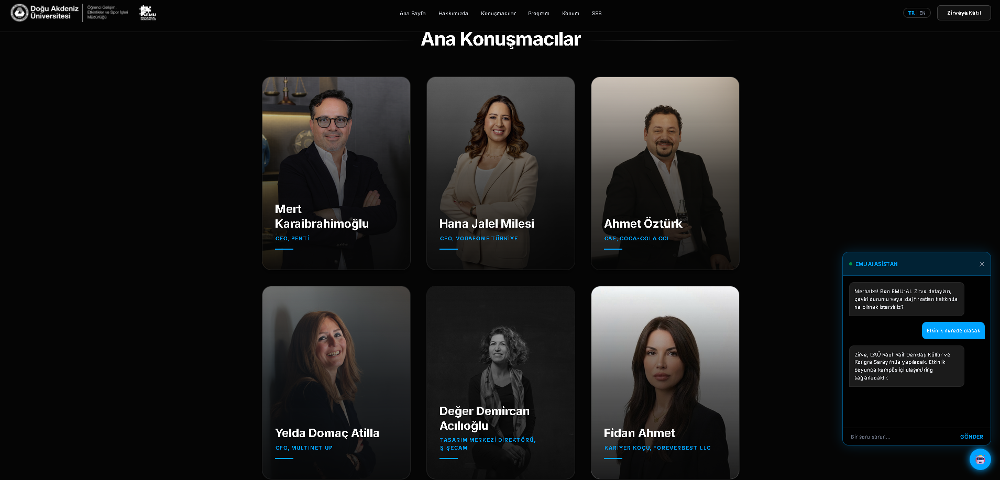
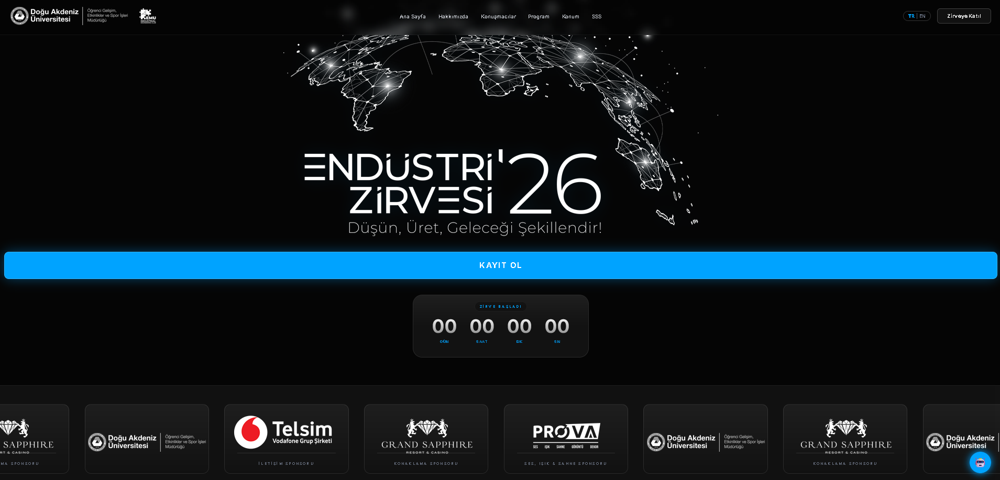

# Industry Summit '26 | EMU Industrial Engineering Club

This is the official web platform for the **Industry Summit '26**, organized by the **Eastern Mediterranean University (EMU) Industrial Engineering Club**. This project was designed and developed to provide a seamless digital experience for one of the most prestigious industrial engineering summits in North Cyprus.

**Live Project:** [industrysummit.emu.edu.tr](https://industrysummit.emu.edu.tr/)

---

## Developer & Project Lead
**Kemal Polat Yalcin** *Vice President at EMU Industrial Engineering Club* *Full Stack Developer & IT Student*

I took full responsibility for the end-to-end development of this platform, from initial UI/UX wireframes to final server deployment on the university infrastructure.

---

## Key Features

- AI Assistant (EMU-AI): A custom-built chatbot designed to answer attendee questions about schedule, location, and certification in real-time.
- Multi-language Support Full localization in Turkish and English to cater to international speakers and guests.
- Responsive Design: A "Mobile-First" approach ensuring a high-tech, futuristic aesthetic across all devices (Desktop, Tablet, Mobile).
- Live Translation Integration: Seamless integration with Microsoft Teams for real-time English translation modules.
- Performance Optimized: Built with Next.js for lightning-fast loading speeds and SEO optimization.

---

## Architecture Decision Record (ADR) & Problem Solving

As a platform designed to serve hundreds of attendees and C-level speakers simultaneously, ensuring performance and a flawless user experience was critical.

**Challenge: Next.js SSR vs. CSR Hydration Mismatch in i18n**
Implementing dynamic multi-language support (English/Turkish) created a significant technical hurdle. The server-rendered HTML (SSR) often conflicted with the client's local storage language preferences (CSR), resulting in hydration errors and unacceptable UI flickering during the initial page load.

**Solution:**
I architected a custom state management strategy using React Hooks to delay the rendering of language-dependent components until the component successfully mounted on the client side. 
* **Impact:** This approach completely eliminated React hydration errors and UI flickering, ensuring a seamless, zero-latency language switching experience while preserving the SEO benefits of Server-Side Rendering.

---

## Tech Stack

- **Framework:** [Next.js](https://nextjs.org/) (React)
- **Styling:** [Tailwind CSS](https://tailwindcss.com/)
- **Language:** [TypeScript](https://www.typescriptlang.org/)
- **Animations:** Framer Motion & CSS Keyframes
- **Deployment:** EMU University Servers (Manual Production Build)

---

## Screenshots

### AI Assistant 

  

### Front-site Interface

  

---

## Technical Highlights

- **Dynamic Head Management:** Managed dynamic browser titles and metadata for a professional user experience.
- **Audio Module:** Integrated ambient background modules to enhance the high-tech atmosphere of the summit.
- **State Management:** Used React Hooks for handling multi-language state and interactive components without performance trade-offs.

---

## Contact & Club Links

- **Developer LinkedIn:** [Kemal Polat Yalcin](https://www.linkedin.com/in/kemal-polat-yal%C3%A7%C4%B1n-232aa3197/)
- **Instagram:** [@emuieclub](https://www.instagram.com/emuieclub)
- **LinkedIn:** [EMU Industrial Engineering Club](https://www.linkedin.com/company/emu-industrial-engineering-society/)

---

  Developed by Kemal Polat Yalcin for EMU IE Club

